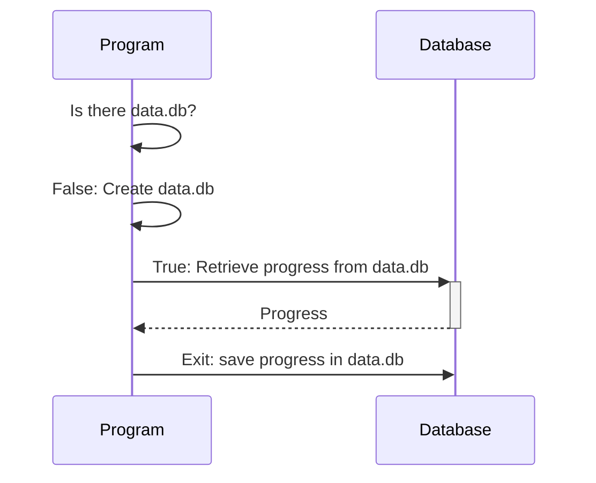

# Saving game progress sequence chart  

```mermaid
sequenceDiagram
    Program->> Program: Is there data.db?
    Program ->> Program: False: Create data.db
    Program ->>+ Database: True: Retrieve progress from data.db
    Database-->>-Program: Progress
    Program ->> Database: Exit: save progress in data.db
```