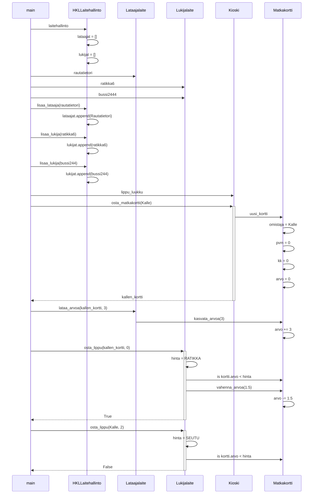

```mermaid
sequenceDiagram
    main->>HKLLaitehallinto: laitehallinto
    HKLLaitehallinto ->> HKLLaitehallinto: lataajat = []
    HKLLaitehallinto ->> HKLLaitehallinto: lukijat = []
    main ->> Lataajalaite: rautatietori
    main ->> Lukijalaite: ratikka6
    main ->> Lukijalaite: bussi2444
    main ->> HKLLaitehallinto: lisaa_lataaja(rautatietori)
    HKLLaitehallinto ->> HKLLaitehallinto: lataajat.append(Rautatietori)
    main ->> HKLLaitehallinto: lisaa_lukija(ratikka6)
    HKLLaitehallinto ->> HKLLaitehallinto: lukijat.append(ratikka6)
    main ->> HKLLaitehallinto: lisaa_lukija(bussi244)
    HKLLaitehallinto ->> HKLLaitehallinto: lukijat.append(bussi244)
    main ->> Kioski: lippu_luukku
    main ->>+ Kioski: osta_matkakortti(Kalle)
    Kioski ->> Matkakortti: uusi_kortti
    Matkakortti ->> Matkakortti: omistaja = Kalle
    Matkakortti ->> Matkakortti: pvm = 0
    Matkakortti ->> Matkakortti: kk = 0
    Matkakortti ->> Matkakortti: arvo = 0
    Kioski -->>- main: kallen_kortti
    main ->> Lataajalaite: lataa_arvoa(kallen_kortti, 3)
    Lataajalaite ->> Matkakortti: kasvata_arvoa(3)
    Matkakortti ->> Matkakortti: arvo += 3
    main ->>+ Lukijalaite: osta_lippu(kallen_kortti, 0)
    Lukijalaite ->> Lukijalaite: hinta = RATIKKA
    Lukijalaite ->> Matkakortti: is kortti.arvo < hinta
    Lukijalaite ->> Matkakortti: vahenna_arvoa(1.5)
    Matkakortti ->> Matkakortti: arvo -= 1.5
    Lukijalaite -->>- main: True
    main ->>+ Lukijalaite: osta_lippu(Kalle, 2)
    Lukijalaite ->> Lukijalaite: hinta = SEUTU
    Lukijalaite ->> Matkakortti: is kortti.arvo < hinta
    Lukijalaite -->>- main: False
```