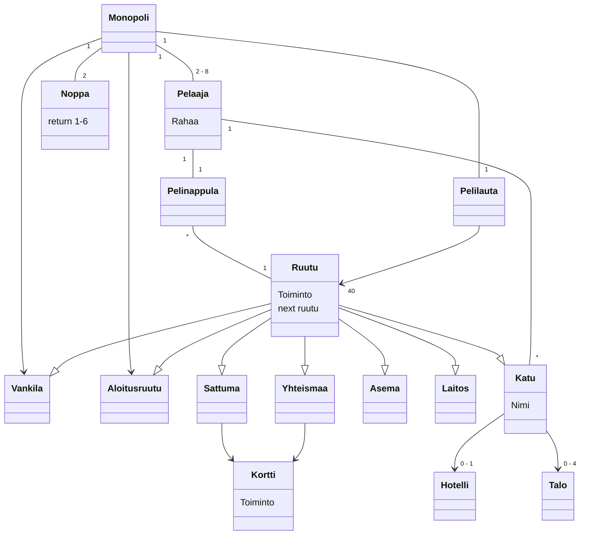

```mermaid
classDiagram
      Pelinappula "*" -- "1" Ruutu
      Pelaaja "1" -- "1" Pelinappula 
      Pelilauta --> "40" Ruutu

      Monopoli "1" -- "1" Pelilauta
      Monopoli "1" -- "2" Noppa
      Monopoli "1" -- "2 - 8" Pelaaja
      Monopoli --> Vankila
      Monopoli --> Aloitusruutu

      Ruutu --|> Aloitusruutu
      Ruutu --|> Vankila
      Ruutu --|> Sattuma
      Ruutu --|> Yhteismaa
      Ruutu --|> Asema
      Ruutu --|> Laitos
      Ruutu --|> Katu

      Katu --> "0 - 1" Hotelli
      Katu --> "0 - 4" Talo

      Pelaaja "1" -- "*" Katu

      Sattuma --> Kortti
      Yhteismaa --> Kortti
      


      class Monopoli{

      }
      class Pelaaja{
        Rahaa
      }
      class Noppa{
        return 1-6
      }

      class Pelinappula{

      }

      class Ruutu{
        Toiminto
        next ruutu
        }
        class Aloitusruutu{

        }
        class Vankila{

        }

        class Sattuma{

        }
        class Yhteismaa{

        }

        class Asema{

        }

        class Laitos{

        }

        class Katu{
            Nimi
        }

        class Kortti{
            Toiminto
        }
        class Talo{

        }
        class Hotelli{

        }

      class Pelilauta{
      }


```